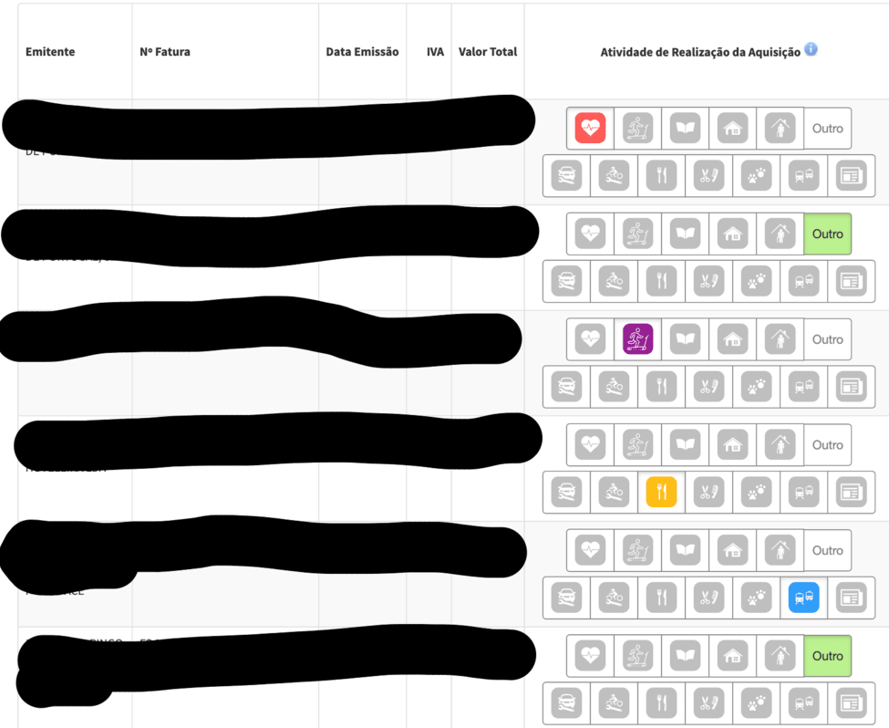

# Efatura Selector

The aim of this project is to, when you access your Efatura validation page, automatically select a category for each
invoice.

There's a list of known invoice emitters, if there's no match, it tries to associate based on keywords for each
category. If no match found too, it defaults to "Outros".

For example, if the invoice emitter contains "restaurante" in its name, it'll select "Alimentação" category.

## DISCLAIMER

> The extension doesn't save the selections, it just clicks on the categories but leaves the user the possibility to change them as they will and leave to him the responsibility to save.

## How it works

- Go to extension page
- Install it on you preferred browser
- And that's it!! Now, every time you open the validation page, it will automatically pick the categories

## Problems or issues?

If you encounter any problems, bugs or other issues with the repo, please create
an [issue in the GitHub repo](https://github.com/PedroS11/Efatura-Selector/issues).